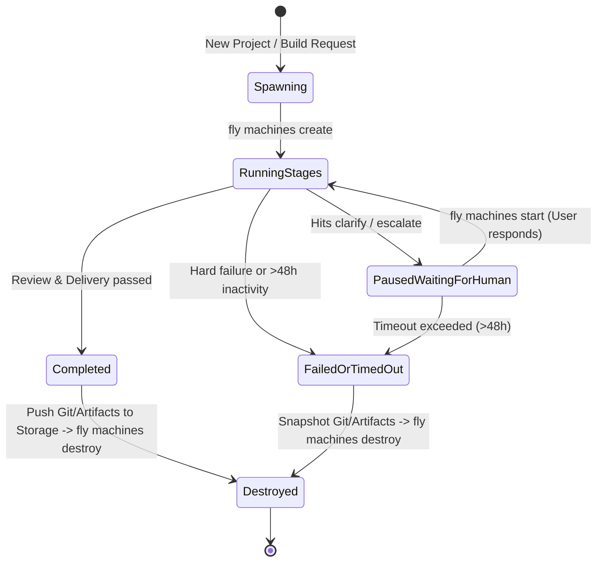

# Cloud Runner Architecture & Lifecycle Design

## Context & Constraints

- **Audience & Stage:** Currently a solo developer project ("Software For One"), possibly expanding to small private/unadvertised usage later.
- **Problem:** The local developer machine (Mac) sleeps when the lid is closed. Multi-stage agent builds (research $\to$ spec $\to$ plan $\to$ build $\to$ review $\to$ repair) take 5–25 minutes and need to execute autonomously in the cloud.
- **Guiding Invariants:** 
  - Keep SFO provider-agnostic (`Runner` interface).
  - $0 when idle (scale to zero; no paying $20–$40/mo for an idle VPS).
  - Zero sysadmin overhead (no manual patching, no host disk pruning).
  - Strict security boundary (builds run arbitrary agent bash; hardware virtualization via microVMs, not shared-kernel Docker).

---

## Architectural Decision: Ephemeral MicroVMs with Start/Stop Lifecycle

### Options Evaluated & Why They Lost

1. **Rented Server + Docker (e.g. Hetzner/DigitalOcean VPS):**
   - *Why rejected:* Paying $20–40/mo for a machine that sits idle 99% of the time. Docker shares the host kernel (breakout hazard when agents execute untrusted bash/npm packages). Docker layer/volume buildup rapidly fills VPS disks on failed runs.
2. **Managed Agent Sandboxes (e.g. E2B, Daytona, proprietary agent APIs):**
   - *Why rejected:* SFO *is* the orchestrator and prompt engine. Handing execution to a proprietary sandbox API breaks SFO's `Runner` portability and introduces an expensive, unnecessary third-party layer.

### Chosen Architecture: Job-Scoped MicroVMs (e.g., Fly.io Machines)

- Build a single base OCI image containing: Node.js, Python, `uv`, Git, Claude Code CLI, and the SFO runtime.
- Provision a dedicated microVM (Firecracker-based) per project build.

---

## The Lifecycle Nuance: Managing Breaks & Human Interactivity

A build is not always a single uninterrupted run. SFO pauses when:
- It enters the `clarify` stage to ask the user a question.
- A stage review `escalates` or hits an ambiguous decision.
- A stage fails and awaits human guidance.

A human may respond in 30 seconds or 12 hours. Leaving a VM running burns compute; spinning up a completely new VM every single stage requires heavy state-sync overhead.

### The Lifecycle Pattern: **Job-Scoped Start/Stop**

### Detailed Lifecycle Rules

1. **Continuous Execution (Research $\to$ Spec $\to$ Plan $\to$ Build):**
   - Run sequentially on the **same VM's local filesystem**.
   - No S3/object-storage roundtrips between consecutive automated stages.
2. **When Pausing for Human (`clarify` / `escalate`):**
   - Send question / notification to the client/database.
   - Stop the machine immediately (`fly machines stop <id>`).
   - **Billing drops to $0/sec compute.**
   - The root disk / local filesystem remains completely intact (repo, git history, installed tool dependencies).
3. **When Resuming After User Answer:**
   - Client sends user response to orchestrator.
   - Orchestrator calls `fly machines start <id>`.
   - The microVM boots in ~1 second with disk state intact.
   - SFO feeds the response to the pending stage and resumes execution.
4. **Completion & Teardown:**
   - On delivery, SFO pushes the resulting git commits and artifacts to remote storage (e.g., GitHub, Cloudflare R2, or S3).
   - The machine is destroyed (`fly machines destroy <id>`).
5. **Safety Timeout:**
   - If a machine remains in the `stopped` state for > 48 hours without human input, an automated sweeper snapshots any uncommitted artifacts to object storage and destroys the machine to prevent orphan disk retention.

---

## Key Takeaway for Implementation

- Implement the cloud runner as a driver for microVMs with **start/stop semantics**, not a cluster of permanent servers.
- The unit of isolation is the **project run**, and the pause mechanism is **machine hibernation (`stop`)**, giving the cost profile of serverless with the simplicity of a local disk.
